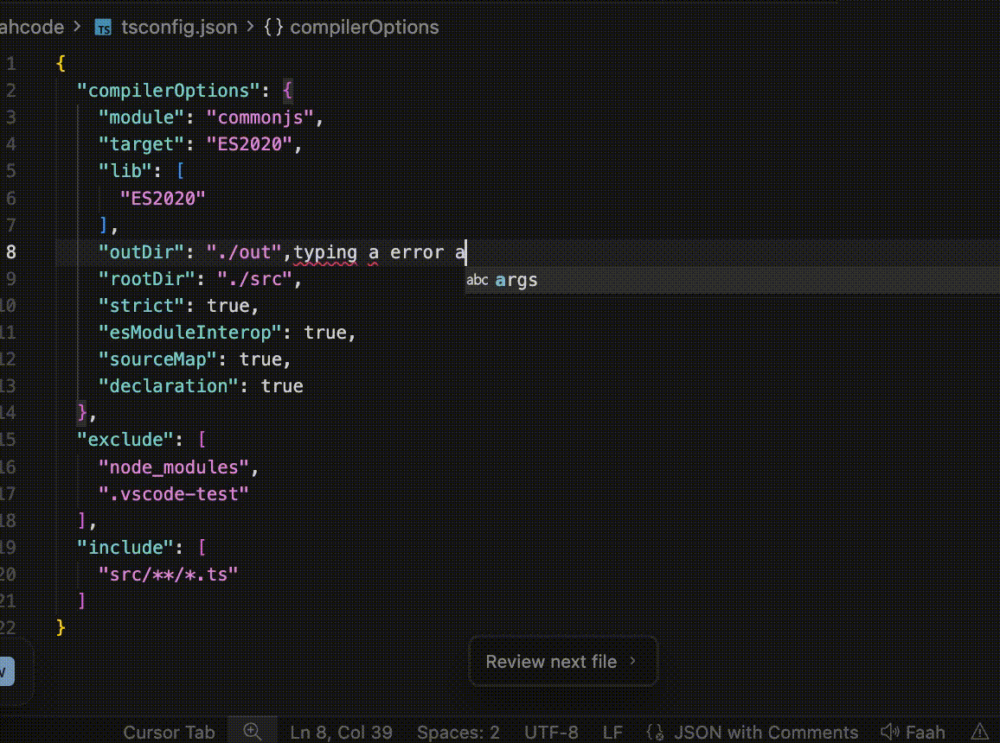
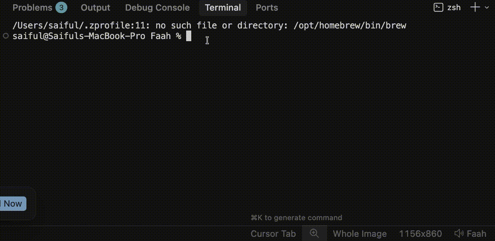
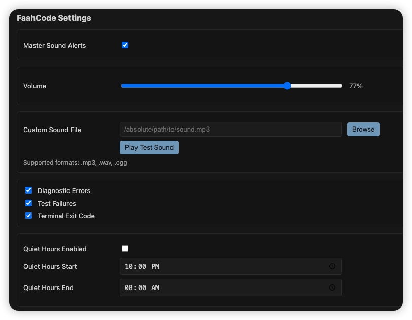

# FaahCode 🔊

> **Your code breaks. You hear it.**

FaahCode plays an alert sound the moment something goes wrong — a compile error, a failing test, a crashed command. No more glancing at the Problems panel. No more missed failures buried in terminal output. Just a sound that says *"hey, go fix that."*

---

## Demo





---

## Why FaahCode?

You're deep in flow. You make a change, switch files, keep writing. Meanwhile, a type error silently appeared three files back. A test you didn't notice has been failing for the last ten minutes. You're building on a broken foundation.

FaahCode turns invisible failures into an unmistakable audio cue — so you catch problems **the moment they happen**, not ten minutes later.

---

## Features

- 🔴 **Diagnostic Errors** — plays when VS Code detects a new error in any open file (TypeScript, ESLint, Python, and any language with a VS Code language server)
- 🧪 **Test Failures** — detects failing output from Jest, Mocha, PyTest, Go test, and Vitest automatically
- 💥 **Terminal Crashes** — plays when any terminal command exits with a non-zero exit code
- 🔇 **One-click mute** — status bar toggle to silence alerts instantly (great for meetings)
- 🎵 **Custom sound** — use any `.mp3`, `.wav`, or `.ogg` file as your alert sound
- 🔊 **Volume control** — adjust independently of your system volume
- 🌙 **Quiet hours** — automatically suppress sounds between set hours
- ⏱️ **Cooldown gate** — prevents sound spam when many errors fire at once
- 🎨 **Settings panel** — dedicated UI accessible from the command palette

---

## Installation

Search **FaahCode** in the VS Code Extensions panel (`Cmd+Shift+X` / `Ctrl+Shift+X`) and click Install.

Or install from the command line:

```bash
code --install-extension faahcode
```

---

## Usage

FaahCode works automatically from the moment it's installed — no configuration needed.

| What you do | What FaahCode does |
|---|---|
| Save a file with a type error | 🔊 Plays alert |
| Run a failing Jest/PyTest/Mocha test | 🔊 Plays alert |
| Run a command that crashes (exit code ≠ 0) | 🔊 Plays alert |
| Fix the error and save | 🔇 Silence |
| All tests pass | 🔇 Silence |

---

## Settings Panel

Open the settings panel from the command palette:

`Cmd+Shift+P` → **FaahCode: Open Settings**

 

From the panel you can:
- Toggle all alerts on/off
- Adjust volume
- Browse for a custom sound file
- Play a test sound
- Enable/disable individual triggers
- Configure quiet hours

---

## Configuration

All settings are also available in VS Code Settings (`Cmd+,` → search `faahcode`):

| Setting | Default | Description |
|---|---|---|
| `faahcode.enabled` | `true` | Master on/off switch |
| `faahcode.volume` | `80` | Volume level (0–100) |
| `faahcode.customSoundPath` | `""` | Path to a custom `.mp3`, `.wav`, or `.ogg` file |
| `faahcode.cooldownMs` | `2000` | Minimum milliseconds between sounds |
| `faahcode.alerts.diagnosticErrors` | `true` | Play on error diagnostics |
| `faahcode.alerts.testFailures` | `true` | Play on test failures |
| `faahcode.alerts.terminalExitCode` | `true` | Play on non-zero terminal exit |
| `faahcode.quietHours.enabled` | `false` | Enable quiet hours |
| `faahcode.quietHours.start` | `"22:00"` | Quiet hours start time (HH:MM) |
| `faahcode.quietHours.end` | `"08:00"` | Quiet hours end time (HH:MM) |

---

## Custom Sound

Want a different sound? Any audio file works.

1. Open **FaahCode: Open Settings** from the command palette
2. Click **Browse** next to Custom Sound
3. Pick any `.mp3`, `.wav`, or `.ogg` file
4. Click **Play Test Sound** to preview it

Or set it directly in settings:

```json
"faahcode.customSoundPath": "/Users/you/sounds/myalert.mp3"
```

Free sound resources: [Freesound.org](https://freesound.org) (filter by CC0 license)

---

## Supported Test Runners

FaahCode automatically detects failures from these runners with no configuration:

| Runner | Detected Pattern |
|---|---|
| Jest | `FAIL` prefix, `● Test suite failed to run` |
| Mocha | `N failing` |
| PyTest | `FAILED` in summary |
| Go test | `--- FAIL` |
| Vitest | `Tests N failed` |

---

## Status Bar

The `🔊 Faah` item in the bottom-right status bar shows the current state at a glance.

- `🔊 Faah` — alerts are active
- `🔇 Faah` — alerts are muted

Click it to toggle. Changes take effect immediately and persist across sessions.

---

## Keyboard Shortcut (Optional)

You can bind the toggle command to a keyboard shortcut. Open `Keyboard Shortcuts` (`Cmd+K Cmd+S`) and search for `faahcode.toggle`.

---

## Requirements

- VS Code `1.85.0` or higher
- No additional software required on macOS or Windows
- Linux requires PulseAudio (`paplay`) or ALSA (`aplay`) — both are standard on most distributions

---

## Extension Size

**59 KB total.** FaahCode is intentionally minimal — no npm runtime dependencies, no native addons, no telemetry.

---

## Contributing

Issues and pull requests are welcome on [GitHub](#https://github.com/Saiful-Islam0/Faah.git).

If FaahCode saves you from a frustrating debugging session, consider leaving a ⭐ review on the Marketplace — it genuinely helps others find it.

---

## License

MIT

---

*Built with VS Code Extension API · TypeScript · Zero runtime dependencies*
